В этом README приведены результаты сравнения метрик тестов, сгенерированных с помощью двух стратегий.

Сравнение проводилось по следующим метрикам:

1. Процент тестового покрытия
2. Количество найденных ошибок при одинаковом покрытии
3. Количество сгенерированных тестов при одинаковом покрытии
4. Время, за которое генерируются тесты при одинаковом покрытии

Каждая точка на графике - это функция, для которой генерировались тесты с помощью двух стратегий, отмеченных на осях. Координаты точки — значения метрик (процент тестового покрытия, количество ошибок, количество сгенерированных тестов, время генерации), полученные для каждой стратегии. 

На всех графиках оранжевым отмечены точки, для которых стратегия, отмеченная на вертикальной оси, показала лучший результат, а синим отмечены точки с противоположным исходом. Черный цвет соответствует одинаковым значениям.

Из-за дискретности величин некоторые точки
могли наложиться друг на друга, из-за чего значений на графике может оказаться меньше, чем заявлено в описании под ним.

### Comp_KLDiv_BCE
На рисунках 1-4 приведены результаты сравнения моделей, которые обучались с использованием двух подходов. \
Стратегия `KLDiv` — модель, обученная оценивать вероятность успеха для каждого пути. \
Стратегия `BCE` — модель, обученная делить пути на перспективные и бесперспективные.

  <table>
    <tr>
      <td align="center" valign="top" style="padding: 10px;">
        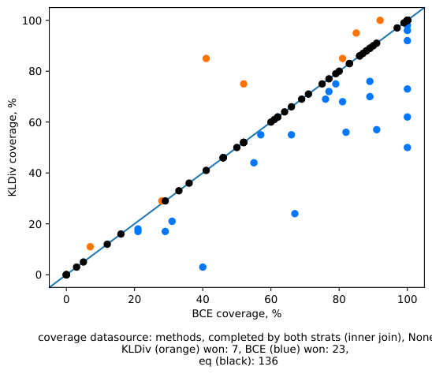 
        <strong>Рис. 1</strong> - Сравнение стратегий по полученному проценту покрытия
      </td>
      <td align="center" valign="top" style="padding: 10px;">
        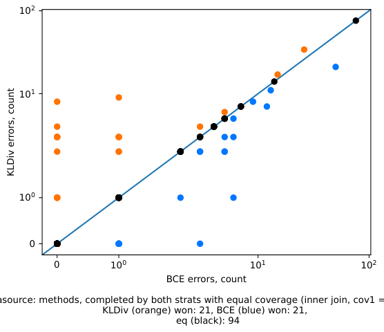 
        <strong>Рис. 2</strong> - Сравнение стратегий по количеству найденных ошибок при одинаковом проценте покрытия
      </td>
    </tr>
    <tr>
      <td align="center" valign="top" style="padding: 10px;">
        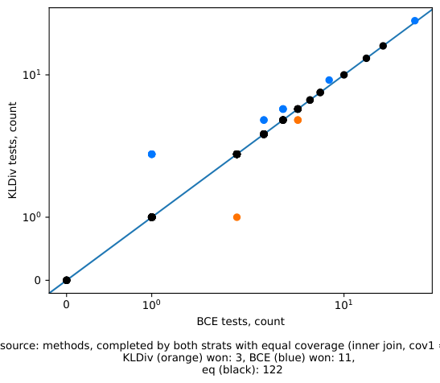 
        <strong>Рис. 3</strong> - Сравнение стратегий по количеству сгенерированных тестов при одинаковом проценте покрытия
      </td>
      <td align="center" valign="top" style="padding: 10px;">
        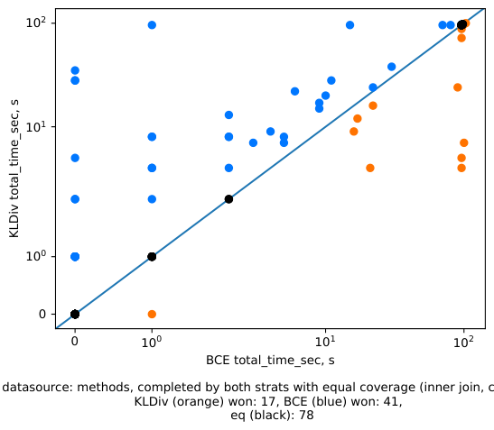 
        <strong>Рис. 4</strong> - Сравнение стратегий по времени исполнения при одинаковом проценте покрытия
      </td>
    </tr>
  </table>

Сравнение показало, что модель, обученная бинарной классификации:

1. Чаще демонстрирует больший процент тестового покрытия. 
2. Чаще находит больше ошибок. 
3. Чаще генерирует меньше тестов для отдельной функции.
4. Чаще затрачивает меньше времени на генерацию тестов.

Модель, обученная бинарной классификации, оказалась лучше по всем параметрам.

### Comp_BCE_BCEnoRoots
На рисунках 1-4 приведены результаты сравнения моделей, которые обучались на датасете с path_condition_root и без него. \
Стратегия `BCE` — модель, обученная бинарной классификации на датасете с path_condition_root. \
Стратегия `BCEnoRoots` — модель, обученная бинарной классификации на датасете без path_condition_root.

  <table>
    <tr>
      <td align="center" valign="top" style="padding: 10px;">
        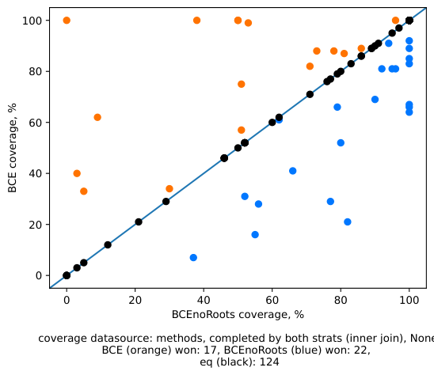 
        <strong>Рис. 1</strong> - Сравнение стратегий по полученному проценту покрытия
      </td>
      <td align="center" valign="top" style="padding: 10px;">
        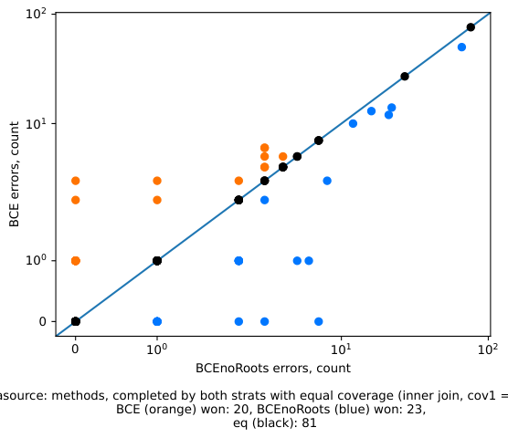 
        <strong>Рис. 2</strong> - Сравнение стратегий по количеству найденных ошибок при одинаковом проценте покрытия
      </td>
    </tr>
    <tr>
      <td align="center" valign="top" style="padding: 10px;">
        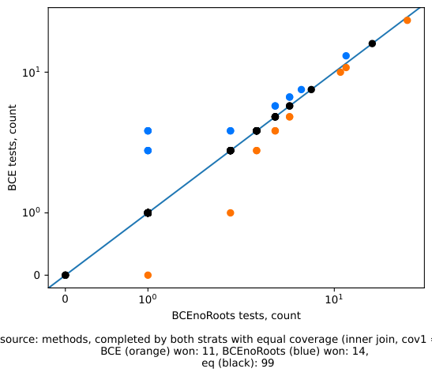 
        <strong>Рис. 3</strong> - Сравнение стратегий по количеству сгенерированных тестов при одинаковом проценте покрытия
      </td>
      <td align="center" valign="top" style="padding: 10px;">
        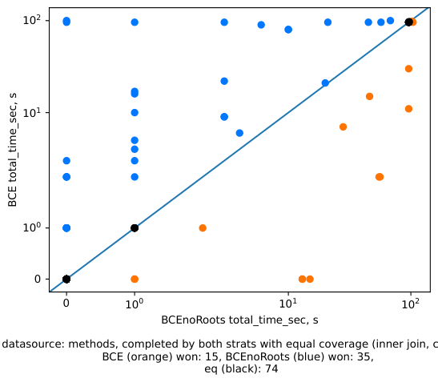 
        <strong>Рис. 4</strong> - Сравнение стратегий по времени исполнения при одинаковом проценте покрытия
      </td>
    </tr>
  </table>

Модель, обученная на датасете без path_condition_root: 
1. Чаще демонстрирует больший процент тестового покрытия. 
2. Чаще находит больше ошибок. 
3. Чаще генерирует меньше тестов для отдельной функции.
4. Чаще затрачивает меньше времени на генерацию тестов.

Модель, обученная на датасете без path_condition_root, оказалась лучше по всем параметрам.

### Comp_V_BCEnoRoots
На рисунках 1-4 приведены результаты сравнения модели, обученной бинарной классификации на датасете без path_condition_root, и селектора V#. \
Стратегия `BCEnoRoots` — модель, обученная на датасете без path_condition_root. \
Стратегия `V#` — символьная машина V#.

  <table>
    <tr>
      <td align="center" valign="top" style="padding: 10px;">
        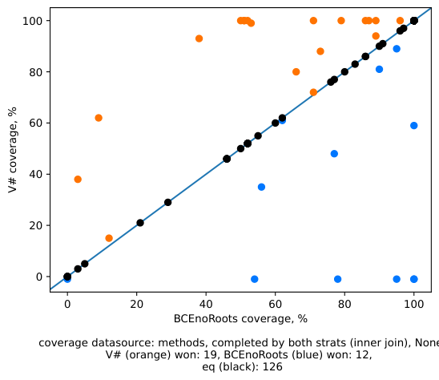 
        <strong>Рис. 1</strong> - Сравнение стратегий по полученному проценту покрытия
      </td>
      <td align="center" valign="top" style="padding: 10px;">
        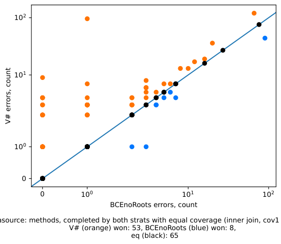 
        <strong>Рис. 2</strong> - Сравнение стратегий по количеству найденных ошибок при одинаковом проценте покрытия
      </td>
    </tr>
    <tr>
      <td align="center" valign="top" style="padding: 10px;">
        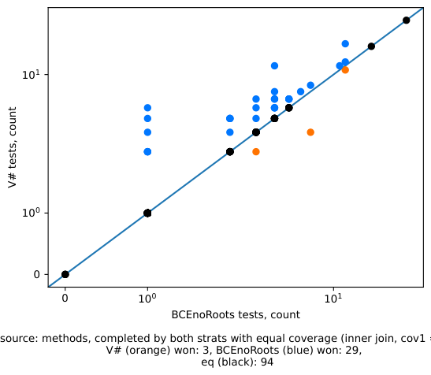 
        <strong>Рис. 3</strong> - Сравнение стратегий по количеству сгенерированных тестов при одинаковом проценте покрытия
      </td>
      <td align="center" valign="top" style="padding: 10px;">
        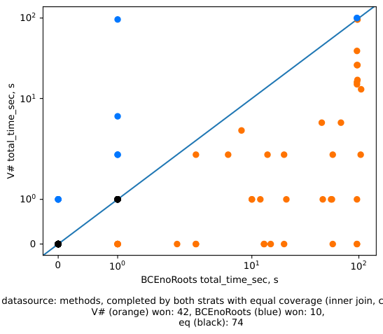 
        <strong>Рис. 4</strong> - Сравнение стратегий по времени исполнения при одинаковом проценте покрытия
      </td>
    </tr>
  </table>

Модель, обученная на датасете без path_condition_root: 
1. Реже демонстрирует больший процент тестового покрытия. 
2. Реже находит больше ошибок. 
3. Чаще генерирует меньше тестов для отдельной функции.
4. Реже затрачивает меньше времени на генерацию тестов.

Модель, обученная бинарной классификации на датасете без path_condition_root, оказалась хуже по всем параметрам, кроме количества тестов.

### Вывод:
Лучшая модель, обученная на датасете без path_condition_root, всё ещё оказалась хуже алгоритмического селектора V#. Однако замена стратегии обучения с оценки вероятности успеха для каждого пути на бинарную классификацию позволила заметно улучшить метрики тестов, генерируемых нейронной сетью. Вероятно, обучение нейронной сети на большем датасете позволило бы достичь дальнейшего улучшения.