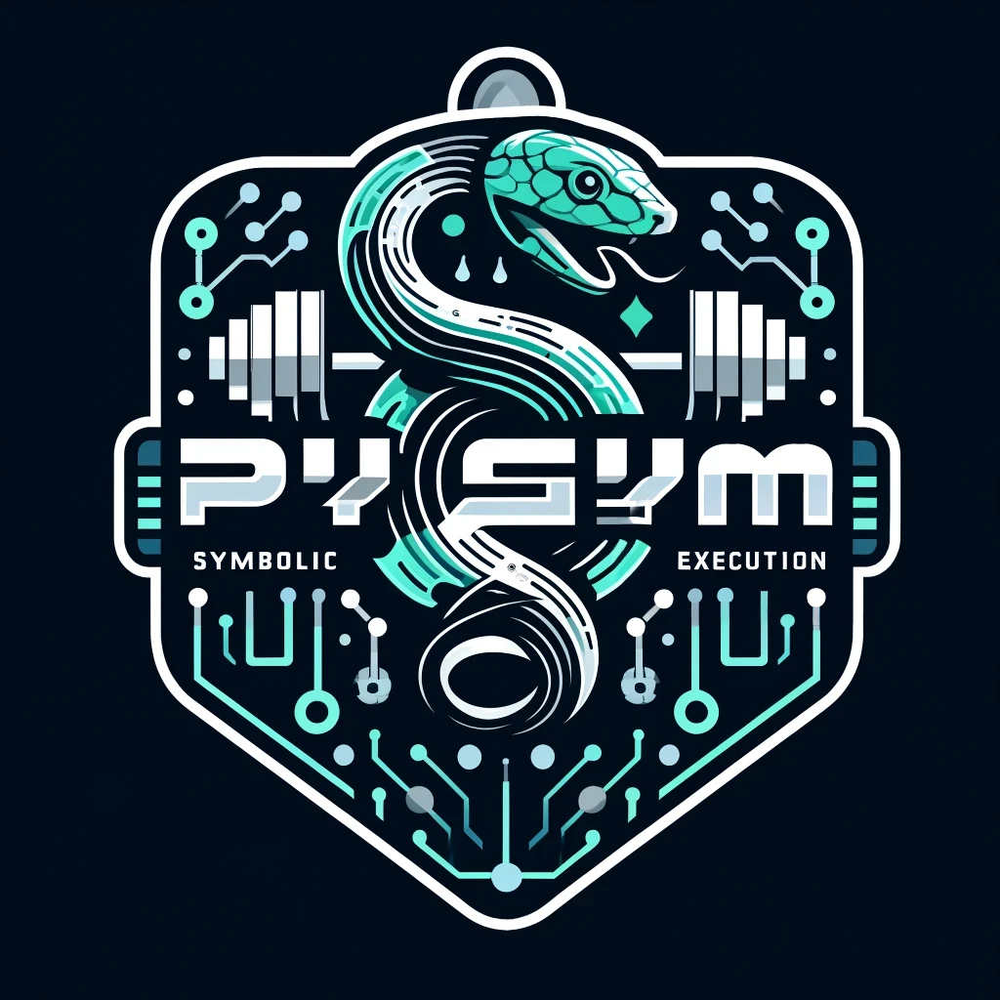
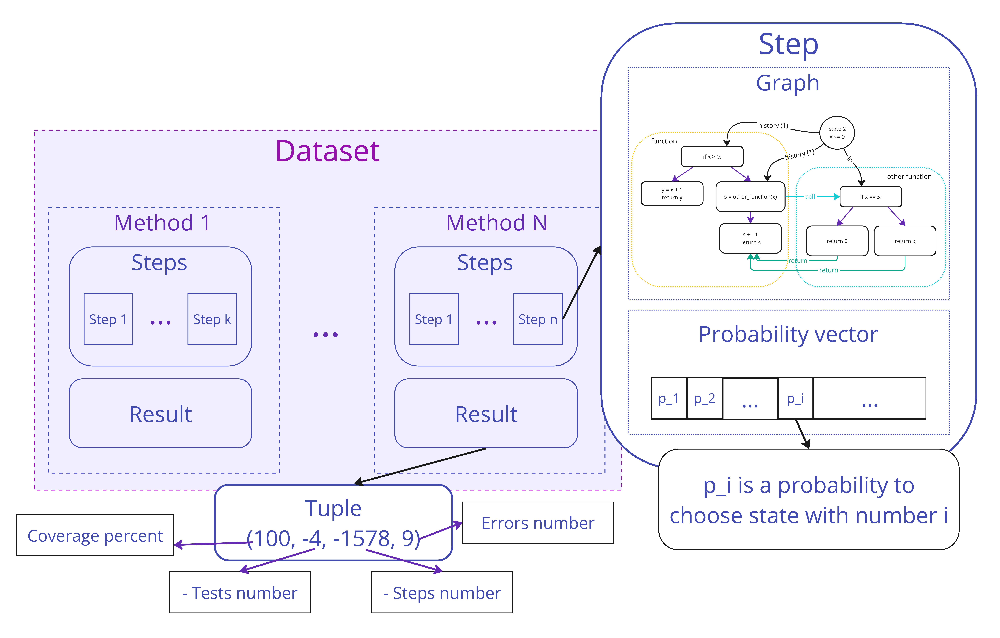
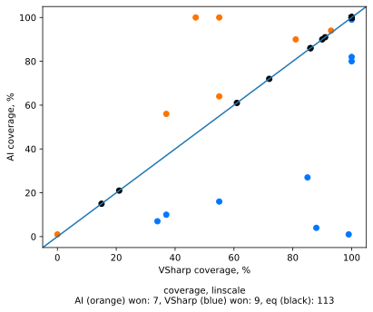
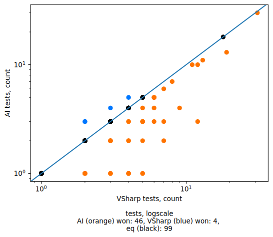

<p align="center">
  
</p>

# PySymGym

[](https://github.com/PySymGym/PySymGym/actions/workflows/python_linting.yaml)
[](https://github.com/PySymGym/PySymGym/actions/workflows/build_and_run.yaml)
[](https://github.com/PySymGym/PySymGym/actions/workflows/python_tests.yaml)

Python infrastructure to train paths selectors for symbolic execution engines.

We treat paths selection as a game where current state of symbolic execution process, represented as a interprocedural control flow graph equipped with information about execution details, is a map of the world (game map). States of symbolic machine are chips that player able to move. Each step, having current game map, player (AI agent) selects state to move and sends it to game server. Server moves selected state and return updated map to the player. Depending on scoring function, player can be aimed to achieve 100% coverage in minimal number of moves, or achieve 100% coverage with minimal number of tests generated, or something else.

Thus we introduced the following components.

- Game server
- Game maps
- AI agent (player)
- Training gym

As far as we use Json-based format to transfer data between server and agent, together with Json-based game maps description, our gym can be used to train networks using different symbolic execution engines.

## Install

```sh
git clone https://github.com/gsvgit/PySymGym.git
git submodule update --init --recursive
```

Build Symbolic Virtual Machines ([V#](https://github.com/VSharp-team/VSharp) and [usvm](https://github.com/UnitTestBot/usvm)) and methods for training. To do this step you need dotnet7, cmake, clang and maven to be installed.

```bash
cd ./PySymGym
make build_SVMs build_maps
```

Create & activate virtual environment:

```bash
python3 -m pip install virtualenv
python3 -m virtualenv .env
source .env/bin/activate
pip install poetry
poetry install
```

### GPU installation:

To use GPU, the correct `torch` and `torch_geometric` version should be installed depending on your host device. You may first need to `pip uninstall` these packages, provided by requirements.
Then follow installation instructions provided on [torch](https://pytorch.org/get-started/locally/) and [torch_geometric](https://pytorch-geometric.readthedocs.io/en/stable/install/installation.html#installation-from-wheels) websites.

## Repo structure

- **AIAgent** contains Python agent and related infrastructure to train network, prepare data, etc.
- **GameServers** contains (as submodules) different symbolic execution engines extended to communicate with the agent, generate data for raining, etc.
- **maps** contains target projects that used as inputs for symbolic execution engines, as data for training.

## Usage

### Follow these steps:

- Build game server
- Build game maps
- Create Json with maps description
  - You can use `./workflow/dataset_for_tests_java.json` as a template
- Generate initial data
- Convert initial data to dataset for training
- Run training process
- Use [`onyx.py`](#onnx-conversion) command line tool convert your PyTorch model to ONNX format.
- Use your ONNX model to run symbolic execution.

### Generate initial dataset

To start supervised learning we need some initial data. It can be obtained using any path selection strategy. In our project we generate initial data with one of strategies from V#. To do it run:

```bash
make init_data
```

Now initial dataset saved in the directory `./AIAgent/report/SerializedEpisodes`. Then it will be updated by neural network if it finds a better solution.

### Run training:


- Create configuration (specifying server and training parameters). You can use [`./workflow/config_for_tests.yml`](./workflow/config_for_tests.yml) as a template.
  - Below we will discuss how you can fully integrate your own symbolic machine
- Launch the server manager
  - `poetry run python3 launch_servers --config path/to/config.yml`
- Run MLFlow server
  - `poetry run mlflow server -h 127.0.0.1 -p 8080 --serve-artifacts`
- Run the training process to get PyTorch model.
  - `poetry run python3 run_training --config path/to/config.yml`

### Integrate a new symbolic machine

_Illustration of game process:_


To integrate a new symbolic machine, it is necessary to:

- See [play_game](AIAgent/ml/game/play_game.py) to implement a server part with support for the websocket protocol
- See [messages](AIAgent/connection/game_server_conn/messages.py) to provide serialization-deserialization of data according to the established protocol
- Implement methods for:

  - Symbolic execution in training mode
  - Running with a trained model

_Integration examples:_

- [VSharp](GameServers/VSharp/) (.NET symbolic machine) and [its maps](maps/DotNet/)
- [usvm](GameServers/usvm/) (JVM symbolic machine) and [its maps](maps/Java/).

Currently we use V# as a primary game server. You can see example of typical workflow in [our automation](.github/workflows/build_and_run.yaml).

### Dataset description

Json

### Agent-server protocol description

Json

### ONNX conversion

To use ONNX conversion tool, locate `onyx.py` script in `AIAgent/` directory. Then run the following command:

```bash
python3 onyx.py --sample-gamestate <game_state0.json> \
    --pytorch-model <model>.pt \
    --savepath <converted_model_save_path>.onnx \
    --import-model-fqn <model.module.fqn.Model> \
    --model-kwargs <yaml_with_model_args.yml> \
    [optional] --verify-on <game_state1.json> <game_state2.json> <game_state3.json> ...
```

model_kwargs yaml file, *verification* game_states and *sample* game_state (use any) can be found in [resources/onnx](resources/onnx/) dir

## Linting tools

Install [ruff](https://docs.astral.sh/ruff/) linter and code formatter by running following command in repo root to check your codestyle before committing:

```sh
pip install ruff

# to autofix all linting problems, run
ruff format
```

**Or** [integrate](https://docs.astral.sh/ruff/integrations/#vs-code-official) it with your favorite code editor (for example, [VSCode](https://marketplace.visualstudio.com/items?itemName=charliermarsh.ruff))

## Project description

### Dataset structure

<p align="center">
  
</p>

### Results

<div align="center">
   
</div>
