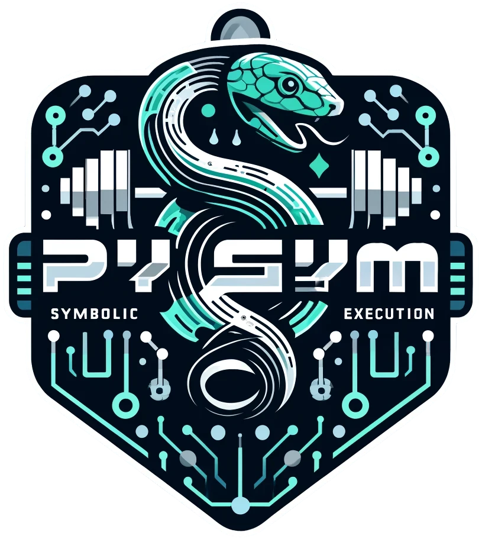
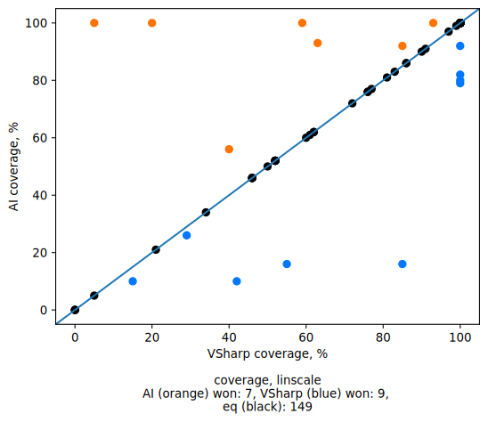

<p align="center">
  
</p>

# PySymGym

[](https://github.com/PySymGym/PySymGym/actions/workflows/python_linting.yaml)
[](https://github.com/PySymGym/PySymGym/actions/workflows/build_and_run.yaml)
[](https://github.com/PySymGym/PySymGym/actions/workflows/python_tests.yaml)

Python infrastructure to train paths selectors for symbolic execution engines.

We treat path selection as a game where the current state of the symbolic execution process, represented as an interprocedural control flow graph equipped with information about execution details, is a map of the world (game map). States of the symbolic machine are chips that the player is able to move. For each step, having a current game map, the player (AI agent) selects the state to move and sends it to the game server. The server moves the selected state and returns the updated map to the player. Depending on the scoring function, the player can aim to achieve 100% coverage in a minimal number of moves, or achieve 100% coverage with a minimal number of tests generated, or something else.

Because we use JSON-based format to transfer data between server and agent, including JSON-based game map description, our gym can be used to train networks using different symbolic execution engines.

## Install

This repository contains submodules, so use the following command to get sources locally.

```sh
git clone https://github.com/gsvgit/PySymGym.git
git submodule update --init --recursive
```

Setup environment:

```bash
pip install poetry
poetry install
```

### GPU installation:

To use GPU, the correct `torch` and `torch_geometric` version should be installed depending on your host device. You may first need to `pip uninstall` these packages, provided by requirements.
Then follow installation instructions provided on [torch](https://pytorch.org/get-started/locally/) and [torch_geometric](https://pytorch-geometric.readthedocs.io/en/stable/install/installation.html#installation-from-wheels) websites.

## Repo structure

- **AIAgent** contains Python agent and related infrastructure to train network, prepare data, etc.
- **GameServers** contains (as submodules) different symbolic execution engines extended to communicate with the agent, generate data for training, etc.
- **maps** contains target projects that used as inputs for symbolic execution engines, as data for training.

## Usage

We use [**MLFlow**](https://mlflow.org/) to log hyper-parameters and training artifacts. Firstly, run MLFlow server:
```sh
cd AIAgent
poetry run mlflow server -h 127.0.0.1 -p 8080 --serve-artifacts
```

_Illustration of game process:_
<div align="center">

</div>

As shown in the sequence diagram the training process consists of _Main Loop_ that implies alternation of two variants of running: _Hyper-parameters Tuning_ (**Hyper-parameters Tuning Loop** in the diagram) and _Dataset improving with symbolic virtual machines_ (**for each method** loop in the diagram).
Before starting the _Main Loop_ you need to [generate initial dataset](#generate-initial-dataset). Then alternate [_Hyper-parameters Tuning_](#hyper-parameters-tuning) and [_Dataset improving with symbolic virtual machines_](#dataset-improvement-with-symbolic-virtual-machines) until the desired result is achieved. Then you can run symbolic execution with the trained model (checkout [this chapter](#guide-symbolic-execution-with-trained-model)).

The main idea of alternation of two ways of running is to get better dataset and tune hyper-parameters taking into account changes in it. So you tune hyper-parameters, get the best neural network of current dataset (it's assumed that this neural network also is better in the symbolic execution than previous one) and then improve the dataset. After the improving dataset probably there are new the best hyper-parameters for the new dataset. So you need to tune it again. 

### Generate initial dataset
To start supervised learning you need some initial data. It can be obtained using any path selection strategy. In our project we generate initial data with one of strategies from V#. To do it run:
```bash
make init_data STEPS_TO_SERIALIZE=<MAX_STEPS>
```
Now initial dataset saved in the directory `./AIAgent/report/SerializedEpisodes`. Then it will be updated by neural network if it finds a better solution.

### Hyper-parameters tuning

We tune hyper-parameters with [**Optuna**](https://optuna.org/). This step is needed to get the best neural network to have more chances for updating dataset during the other variant of running.

1) Create configuration (specifying training parameters). You can use [`./workflow/config_for_tests.yml`](./workflow/config_for_tests.yml) as a template.
  To use the loss function that is used for training as objective function for hyper-parameters tuning, set the validation config as follow:
    ```yml
    ValidationConfig:
      validation:
        val_type: loss
        batch_size: <DEPENDS_ON_YOUR_RAM_SIZE>
    ```
    Configure optuna, for example, as follow:
    ```yml
    OptunaConfig:
      n_startup_trials: 10
      n_trials: 30
      n_jobs: 1
      study_direction: "minimize"
    ```
1) Move to **AIAgent** directory
    ```sh
    cd AIAgent
    ```
2) Run the training process.
    ```sh
    poetry run python3 run_training.py --config path/to/config.yml
    ```

### Dataset improvement with Symbolic Virtual Machines

As the optimal sequence of symbolic execution steps is unknown we try to get relatively good ones using the best models from the previous step. To do it follow these steps: 

1) Build Symbolic Virtual Machines ([V#](https://github.com/VSharp-team/VSharp) and [usvm](https://github.com/UnitTestBot/usvm)) and methods for training. To do this step, you need to install .NET 7, cmake, clang, and maven.
    ```sh
    make build_SVMs build_maps
    ``` 
    Optionally add new maps to [maps](./maps/) and integrate the other SVM (checkout [integration chapter](#integrate-a-new-symbolic-machine)).
2) Using [`example from workflow`](`./workflow/dataset_for_tests_java.json`) as a template, create your own configuration with maps to use for training or use the existing ones located in `maps/*/Maps/dataset.json`.
3) Create configuration (specifying server's and training parameters). You can use [`./workflow/config_for_tests.yml`](./workflow/config_for_tests.yml) as a template. 
  Add to the configuration the best weights URI and appropriate trial URI (they were logged with MLFlow during hyper-parameters tuning):
    ```yml
    weights_uri: mlflow-artifacts:/<EXPERIMENT_ID>/<RUN_ID>/artifacts/trial.pkl
    
    OptunaConfig:
      ...
      trial_uri: mlflow-artifacts:/<EXPERIMENT_ID>/<RUN_ID>/artifacts/<EPOCH>/model.pth
    ```
4) Move to **AIAgent** directory
    ```sh
    cd AIAgent
    ```
5) Launch the server manager.
    ```
    poetry run python3 launch_servers.py --config path/to/config.yml
    ```
6) Run the training process.
    ```sh
    poetry run python3 run_training.py --config path/to/config.yml
    ```

### Guide symbolic execution with trained model

After training choose the best model of those that was logged with MLFlow and run symbolic execution using the following instructions: 

1) Use [`onyx.py`](#onnx-conversion) command line tool to convert your PyTorch model to ONNX format.
2) Use your ONNX model to guide symbolic execution with your SVM (checkout [integration chapter](#integrate-a-new-symbolic-machine)) or use existing extension to one of SVMs in this repo:
    - Place your model in `./VSharp/VSharp.Explorer/models/model.onnx`
    - Run 
      ```
      dotnet GameServers/VSharp/VSharp.Runner/bin/Release/net7.0/VSharp.Runner.dll --method BinarySearch maps/DotNet/Maps/Root/bin/Release/net7.0/ManuallyCollected.dll --timeout 120 --strat AI --check-coverage
      ```

### Integrate a new symbolic machine

To integrate a new symbolic machine, it is necessary to:

- See [play_game](AIAgent/ml/game/play_game.py) to implement a server part with support for the websocket protocol
- See [messages](AIAgent/connection/game_server_conn/messages.py) to provide serialization-deserialization of data according to the established protocol
- Implement methods for:

  - Symbolic execution in training mode (example: `./VSharp/VSharp.ML.GameServer.Runner/Main.fs`)
  - Running with a trained model (example: `./VSharp/VSharp.Explorer/AISearcher.fs`)

_Integration examples:_ see [GameServers](GameServers/) directory. There are 2 integrated symbolic machines at present:

- [VSharp](https://github.com/PySymGym/VSharp) (.NET symbolic machine) and [its maps](maps/DotNet/)
- [usvm](https://github.com/PySymGym/usvm) (JVM symbolic machine) and [its maps](maps/Java/).

Currently we use V# as a primary game server. You can see example of typical workflow in [our automation](.github/workflows/build_and_run.yaml).

### ONNX conversion

To use ONNX conversion tool run the following commands:

```bash
cd AIAgent
python3 onyx.py --sample-gamestate <game_state0.json> \
    --pytorch-model <path_to_model>.pth \
    --savepath <converted_model_save_path>.onnx \
    --import-model-fqn <model.module.fqn.Model> \
    --model-kwargs <yaml_with_model_args>.yml \
    [optional] --verify-on <game_state1.json> <game_state2.json> <game_state3.json> ...
```

- `pytorch-model` is a path to PyTorch model's weights.
- Examples of `model-kwargs` yaml file, _verification_ game_states and `sample-gamestate` (use any) can be found in [resources/onnx](resources/onnx/). 
- `import-model-fqn` is a path to the class of the model you want to convert. For example, `ml.models.RGCNEdgeTypeTAG3VerticesDoubleHistory2Parametrized.model.StateModelEncoder`.

## Linting tools

Install [ruff](https://docs.astral.sh/ruff/) linter and code formatter by running following command in repo root to check your codestyle before committing:

```sh
pip install ruff

# to autofix all linting problems, run
ruff format
```

**Or** [integrate](https://docs.astral.sh/ruff/integrations/#vs-code-official) it with your favorite code editor (for example, [VSCode](https://marketplace.visualstudio.com/items?itemName=charliermarsh.ruff))

## Results
_Comparison of the selector based on our model (AI) with the best selector of V#. All metrics except coverage provided for methods with equal coverage._
<div align="center">
   
</div>
<div align="center">
   
</div>

*ExecutionTreeContributedCoverage* searcher claimed to be the best in V# for test generation and was chosen as a reference.
Both searchers were executed with a timeout of 180 seconds for each method.

Our model demonstrates slightly better average coverage (87.97% vs 87.61%) in a slightly worse average time (22.8 sec vs 18.5 sec). Detailed analysis shows that the trained model generates significantly fewer tests (as expected with respect to an objective function) but reports fewer potential errors (which also correlates with the objective function).
