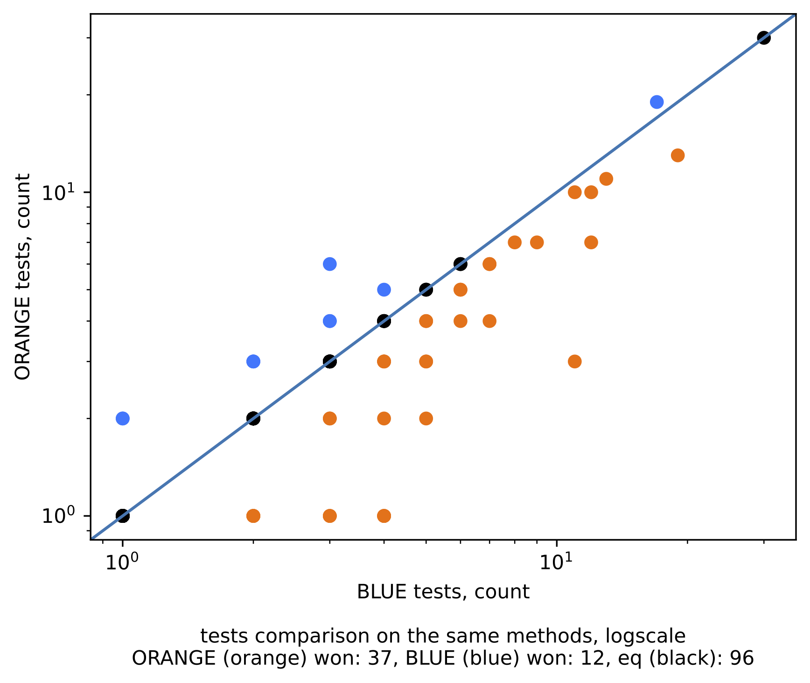

# Howto:

## Installation

```bash
python3 -m venv .env
source .env/bin/activate
pip install -r requirements.txt
```

## Usage

### Run

Docs:

```bash
usage: runstrat.py [-h] -s STRATEGY [-mp MODEL_PATH] -t TIMEOUT [-ps PYSYMGYM_PATH] [-as dlls-path launch-info-path]

options:
  -h, --help            show this help message and exit
  -s STRATEGY, --strategy STRATEGY
                        V# searcher strategy
  -mp MODEL_PATH, --model-path MODEL_PATH
                        Absolute path to AI model if AI strategy is selected
  -t TIMEOUT, --timeout TIMEOUT
                        V# runner timeout
  -ps PYSYMGYM_PATH, --pysymgym-path PYSYMGYM_PATH
                        Absolute path to PySymGym
  -as dlls-path launch-info-path, --assembly-infos dlls-path launch-info-path
                        Provide tuples: dir with dlls/assembly info file
```

To start benchmark, run

```bash
python3 runstrat.py \
    --strategy AI \
    --timeout 120 \
    --pysymgym-path /Users/emax/Data/PySymGym \
    --assembly-infos /Users/emax/Data/PySymGym/mavps/DotNet/Maps/Root/bin/Release/net7.0 /Users/emax/Data/python/vsharp_searcher_bench/prebuilt/assembled.csv \v
    --assembly-infos /Users/emax/Data/python/vsharp_searcher_bench/prebuilt/cosmos/publish prebuilt/cosmos_os.csv \
    --assembly-infos /Users/emax/Data/python/vsharp_searcher_bench/prebuilt/powershell-osx-arm64 prebuilt/powershell.csv
```

Or shortened version:

```bash
python3 runstrat.py \
    -s AI \
    -t 120 \
    -ps /Users/emax/Data/PySymGym \
    -as /Users/emax/Data/PySymGym/maps/DotNet/Maps/Root/bin/Release/net7.0 prebuilt/assembled.csv \
    -as prebuilt/cosmos/publish prebuilt/cosmos_os.csv \
    -as prebuilt/powershell-osx-arm64 prebuilt/powershell.csv
```

### Comparison

Docs:
```bash
usage: compstrat.py [-h] -s1 STRAT1 -r1 RUN1 -s2 STRAT2 -r2 RUN2 -cp CONFIGS_PATH [--savedir SAVEDIR]

options:
  -h, --help            show this help message and exit
  -s1 STRAT1, --strat1 STRAT1
                        Name of the first strategy
  -r1 RUN1, --run1 RUN1
                        Path to the first strategy run result
  -s2 STRAT2, --strat2 STRAT2
                        Name of the second strategy
  -r2 RUN2, --run2 RUN2
                        Path to ther second strategy run result
  -cp CONFIGS_PATH, --configs-path CONFIGS_PATH
                        Path to ther second strategy run result
  --savedir SAVEDIR     Path to save results to
```
To compare two results run

```bash
python3 compstrat.py \
    -s1 ALHPA -r1 mock_runs/strat_alpha.csv \
    -s2 BETA -r2 mock_runs/strat_beta.csv \
    -cp resources/compare_confs.yaml
```

Output example

